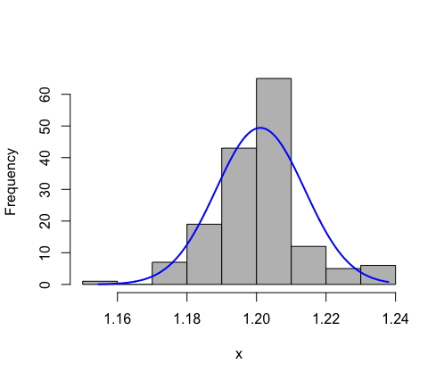

# DS105-02-05 - Transformations in R Activity

[TOC]

---


## Directions

Using the **[cruise ship data](https://repo.exeterlms.com/documents/V2/DataScience/Intermediate-Stats/cruise_ship.zip)**, determine whether each continuous variable is: 
> <mark style="background: #ABF7F7A6;">positively skewed</mark>
> <mark style="background: #FFB86CA6;">negatively skewed</mark>
> <mark style="background: #D2B3FFA6;">normally distributed</mark>

Then perform the correct transformations to get as close to the normal distribution as possible for each variable.


## Continuous Variables for `cruise_ship.xlsx`

- `YearBlt`
- `Tonnage`
- `passngrs`
- `Length`
- `Cabins`
- `Crew`
- `PassSpcR`
- `outcab`


---


# Variable: `YearBlt`

> <mark style="background: #FFB86CA6;">negatively skewed</mark> -> Transformed with: Tukey's Ladder of Power
> 
---


# Variable: `Tonnage`

> <mark style="background: #ABF7F7A6;">positively skewed</mark> -> Transformed with: Tukey's Ladder of Power
> 
---


# Variable: `passngrs`

> <mark style="background: #ABF7F7A6;">positively skewed</mark> -> Transformed with: Tukey's Ladder of Power
> 
---


# Variable: `Length`

> <mark style="background: #FFB86CA6;">negatively skewed</mark> -> Transformed with: Tukey's Ladder of Power
> 
---


# Variable: `Cabins`

> <mark style="background: #ABF7F7A6;">positively skewed</mark> -> Transformed with: Tukey's Ladder of Power
>
---


# Variable: `Crew`

> <mark style="background: #ABF7F7A6;">positively skewed</mark> -> Transformed with: Tukey's Ladder of Power
>
---


# Variable: `PassSpcR`

> <mark style="background: #ABF7F7A6;">positively skewed</mark> -> Transformed with: Tukey's Ladder of Power
>
---


# Variable: `outcab`

> <mark style="background: #ABF7F7A6;">positively skewed</mark> -> Transformed with: Tukey's Ladder of Power
>
---


# Code

 [DS105-02-05 - Transformations in R Activity - cruise ships.R](DS105-02-05 - Transformations in R Activity - cruise ships.R) 

```
# DS105-02-05 - Transformations in R Activity - cruise ships
###############################################################################

#==============================================================================
# INSTALL AND LOAD PACKAGES

# install.packages("rcompanion")
# install.packages("readxl") # for reading Excel files
library("rcompanion")
library("readxl")

# LOAD DATA
cruise_ship <- read_excel("./assets/cruise_ship.xlsx")

# VIEW THE DATA
View(cruise_ship)

#==============================================================================
# VARIABLE: `YearBlt`

# PLOT NORMAL HISTORGRAM FOR VARIABLE
plotNormalHistogram(cruise_ship$YearBlt)

# TRANSFORM:
cruise_ship$YearBltTUK <- transformTukey(cruise_ship$YearBlt, plotit=FALSE)


# RUN HISTOGRAM AGAIN
plotNormalHistogram(cruise_ship$YearBltTUK)


#==============================================================================
# VARIABLE: `Tonnage`

# PLOT NORMAL HISTORGRAM FOR VARIABLE
plotNormalHistogram(cruise_ship$Tonnage)

# TRANSFORM: TUKEY'S LADDER OF POWER
cruise_ship$TonnageTUK <- transformTukey(cruise_ship$Tonnage, plotit=FALSE)

# RUN HISTOGRAM AGAIN
plotNormalHistogram(cruise_ship$TonnageTUK)

#==============================================================================
# VARIABLE: `passngrs`

# PLOT NORMAL HISTORGRAM FOR VARIABLE
plotNormalHistogram(cruise_ship$passngrs)

# TRANSFORM: TUKEY'S LADDER OF POWER
cruise_ship$passngrsTUK <- transformTukey(cruise_ship$passngrs, plotit=FALSE)

# RUN HISTOGRAM AGAIN
plotNormalHistogram(cruise_ship$passngrsTUK)

#==============================================================================
# VARIABLE: `Length`

# PLOT NORMAL HISTORGRAM FOR VARIABLE
plotNormalHistogram(cruise_ship$Length)

# TRANSFORM:
cruise_ship$LengthTUK <- transformTukey(cruise_ship$Length, plotit=FALSE)


# RUN HISTOGRAM AGAIN
plotNormalHistogram(cruise_ship$LengthTUK)


#==============================================================================
# VARIABLE: `Cabins`

# PLOT NORMAL HISTORGRAM FOR VARIABLE
plotNormalHistogram(cruise_ship$Cabins)

# TRANSFORM: TUKEY'S LADDER OF POWER
cruise_ship$CabinsTUK <- transformTukey(cruise_ship$Cabins, plotit=FALSE)

# RUN HISTOGRAM AGAIN
plotNormalHistogram(cruise_ship$CabinsTUK)


#==============================================================================
# VARIABLE: `Crew`

# PLOT NORMAL HISTORGRAM FOR VARIABLE
plotNormalHistogram(cruise_ship$Crew)

# TRANSFORM: TUKEY'S LADDER OF POWER
cruise_ship$CrewTUK <- transformTukey(cruise_ship$Crew, plotit=FALSE)

# RUN HISTOGRAM AGAIN
plotNormalHistogram(cruise_ship$CrewTUK)


#==============================================================================
# VARIABLE: `PassSpcR`

# PLOT NORMAL HISTORGRAM FOR VARIABLE
plotNormalHistogram(cruise_ship$PassSpcR)

# TRANSFORM: TUKEY'S LADDER OF POWER
cruise_ship$PassSpcRTUK <- transformTukey(cruise_ship$PassSpcR, plotit=FALSE)

# RUN HISTOGRAM AGAIN
plotNormalHistogram(cruise_ship$PassSpcRTUK)


#==============================================================================
# VARIABLE: `outcab`

# PLOT NORMAL HISTORGRAM FOR VARIABLE
plotNormalHistogram(cruise_ship$outcab)

# TRANSFORM: TUKEY'S LADDER OF POWER
cruise_ship$outcabTUK <- transformTukey(cruise_ship$outcab, plotit=FALSE)

# RUN HISTOGRAM AGAIN
plotNormalHistogram(cruise_ship$outcabTUK)


```

###